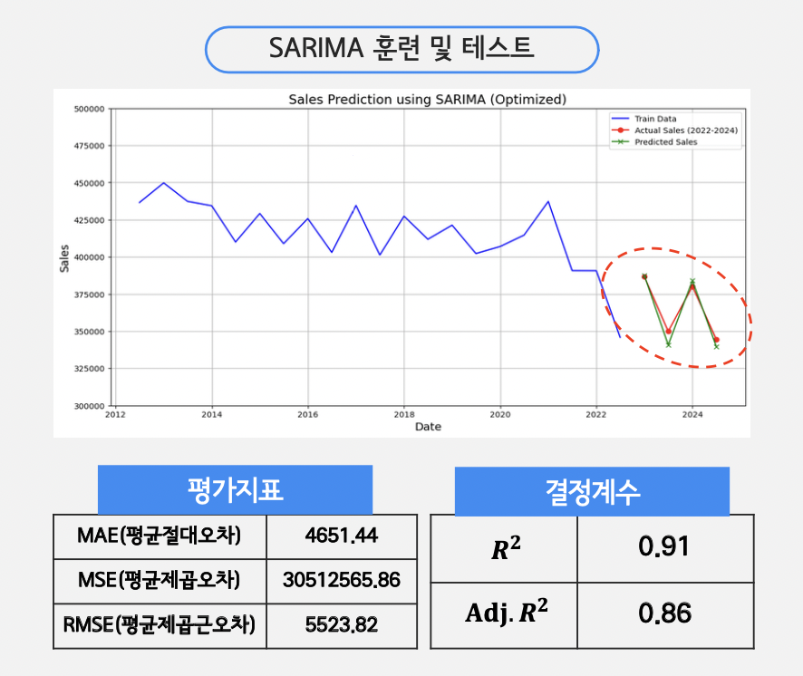
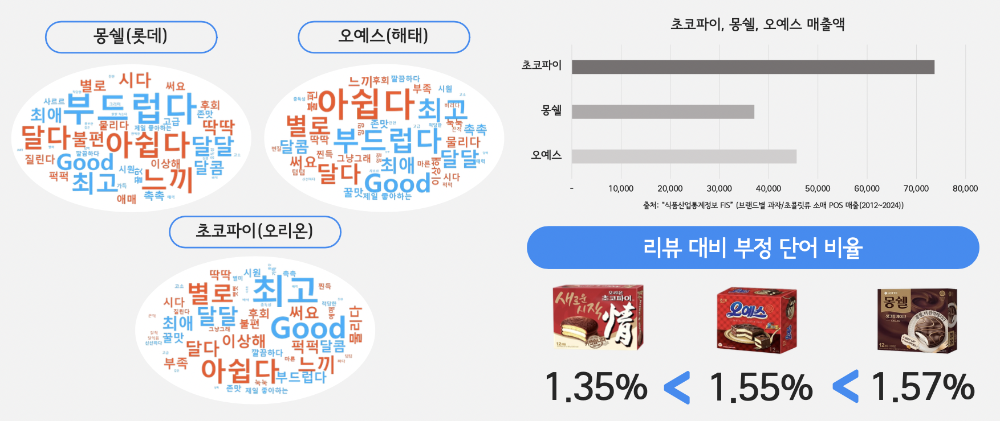
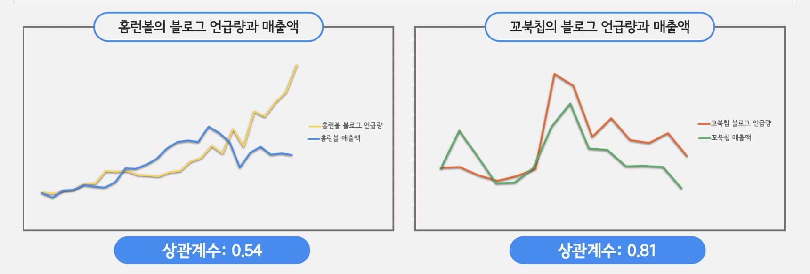
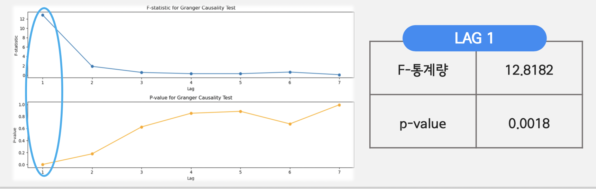

# 🌟 파이썬 데이터 분석 Project : 스낵시장의 트랜드와 소비자 요구

### 프로젝트 발표 자료
- 프로젝트의 전체 내용은 아래 PDF 파일에서 확인할 수 있습니다. 
 
  👉 [발표 자료 다운로드 - pdf](https://github.com/Kim-Jun-Hee/project4/blob/main/파이썬포트폴리오.pdf)  
  👉 [발표 자료 다운로드 - pptx](https://github.com/Kim-Jun-Hee/project4/blob/main/python_port.pptx) 
  
📥 **다운로드 안내**  
💡 **PDF**: 오른쪽 상단의 다운로드 버튼을 누르면 다운로드가 가능합니다.  
⚠️ **PPTX**: 미리보기가 지원되지 않으므로 반드시 다운로드 후 열어보세요.
  

### 📂 프로젝트 목표
- 시계열 분석을 통해 스낵 시장의 반기별 매출을 예측하고 미래 시장 흐름을 전망
- 소비자 리뷰와 블로그 언급량 데이터를 활용해 감정 및 매출 간의 상관관계를 분석
- 트렌드 변화가 매출에 미치는 영향을 평가하고 구매 결정 요인을 도출
  

### 📅 프로젝트 기간
- 2024.10.01 ~ 2024.10.23
  

### 프로젝트 인원 및 역할
- 총인원: 3명
- 개인 작업: 시계열을 통한 미래 스낵시장 예측 및 과자 언급량 분석, 크롤링 코드 제작
- 공동 작업: 리뷰 데이터 크롤링,데이터 전처리
  

### 사용된 기술 및 도구

#### 💻 주요 기술
 **Python** (Pandas, NumPy, Matplotlib,BeautifulSoup,sklearn..)

#### 🛠️ 도구
 

### 🏆 주요 결과물
<table>
  <tr>
    <td align="center">🌟 SARIMA 모델로 매출 예측</td>
    <td align="center">🌟 과자 리뷰를 통한 워드클라우드</td>
  </tr>
  <tr>
    <td>
      
    </td>
    <td>
      
    </td>
  </tr>
  <tr>
    <td align="center">🌟 언급량과 매출 간의 상관관계</td>
    <td align="center">🌟 트렌드와 매출 간의 그랜저 인과관계</td>
  </tr>
  <tr>
    <td>
      
    </td>
    <td>
      
    </td>
  </tr>
</table>
