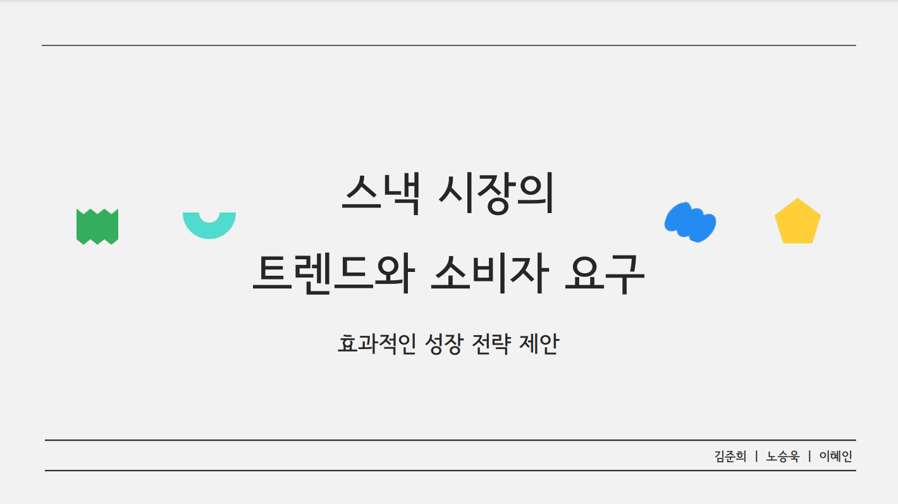

# 🌟 파이썬 데이터 분석 Project : 스낵시장의 트랜드와 소비자 요구

### 프로젝트 발표 자료
- 프로젝트의 전체 내용은 아래 PDF 파일에서 확인할 수 있습니다. 
 
  👉 [발표 자료 다운로드 - pdf](https://github.com/Kim-Jun-Hee/project4/blob/main/파이썬포트폴리오.pdf)  
  👉 [발표 자료 다운로드 - pptx](https://github.com/Kim-Jun-Hee/project4/blob/main/python_port.pptx)
  

### 📂 프로젝트 목표
- 시계열 분석을 통해 스낵 시장의 반기별 매출을 예측하고 미래 시장 흐름을 전망
- 소비자 리뷰와 블로그 언급량 데이터를 활용해 감정 및 매출 간의 상관관계를 분석
- 트렌드 변화가 매출에 미치는 영향을 평가하고 구매 결정 요인을 도출
  

### 📅 프로젝트 기간
- 2024.10.01 ~ 2024.10.23
  
### 프로젝트 인원 및 역할
- 총인원: 3명
- 맡은 역할: 시계열을 통한 미래 스낵시장 예측 및 과자 언급량 분석
  
### 사용된 기술 및 도구

#### 💻 주요 기술
- Python (Pandas, NumPy, Matplotlib,BeautifulSoup)

#### 🛠️ 도구
 

### 주요 결과물
- SARIMA 모델로 매출 예측 (R²: 0.91)
- 과자 리뷰를 통한 워드클라우드
- 언급량과 매출 간의 상관관계
- 트렌드와 매출 간의 그랜저 인과관계
